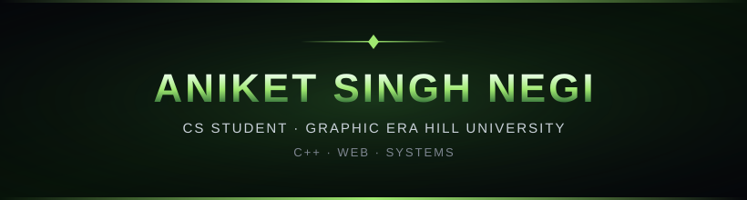

<!-- ═══════════════════════════════════════════════════════════════
     ANIKET SINGH NEGI · PROFILE README (Doomsday color theme)
     ═══════════════════════════════════════════════════════════════ -->

<picture>
  <source media="(prefers-color-scheme: dark)" srcset="assets/doom-banner.svg">
  
</picture>


##  &nbsp;ABOUT ME

```yaml
name: Aniket Singh Negi
college: Graphic Era Hill University, Dehradun
focus: Java, C++, Web Development
learning: OS, DBMS, Design & Analysis of Algorithms
current_project: cloud-bank
```

##  &nbsp;TERMINAL

<div align="center">
  
</div>

##  &nbsp;TECH STACK

<div align="center">
  
</div>

<div align="center">
  &nbsp;
  &nbsp;
  &nbsp;
  &nbsp;
  &nbsp;
  &nbsp;
  &nbsp;
  
</div>

##  &nbsp;PROJECTS

<div align="center">
  
</div>

| Project | What it is |
| --- | --- |
| [cloud-bank](https://github.com/Aniketnegi12/cloud-bank) | Banking web app built with HTML, CSS and JavaScript |
| [PBL-OS-and-DBMS](https://github.com/Aniketnegi12/PBL-OS-and-DBMS) | OS + DBMS concepts demoed in JavaScript |
| [PBL-DAA](https://github.com/Aniketnegi12/Akansh475/PBL-DAA) | Design & analysis of algorithms in C++ |
| [pbl-java](https://github.com/Aniketnegi12/pbl-java) | Java programs and lab exercises |

## ⚡ &nbsp;GITHUB STATS

<div align="center">
  <a href="https://github.com/Aniketnegi12?tab=repositories"></a>
</div>

<div align="center">
  
</div>

<div align="center">
  <picture>
    <source media="(prefers-color-scheme: dark)" srcset="https://github.com/Aniketnegi12/aniketnegi12/raw/output/github-snake-dark.svg">
    
  </picture>
</div>

<div align="center">
  
</div>

<div align="center">
  <sub><b>Visitors</b></sub><br>
  <br>
  <sub>Thanks for visiting!</sub>
</div>
